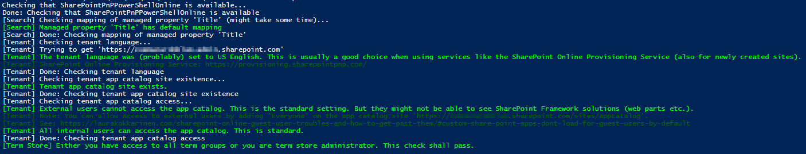
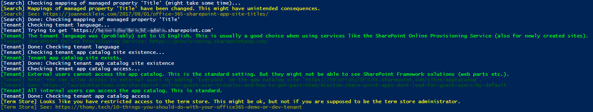
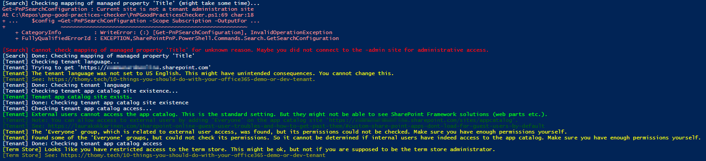

# PnP Good Practices Checker for SharePoint Online Tenants

There are several good practices that can be applied to SharePoint Online tenants. Some are listed for example [here](https://thomy.tech/10-things-you-should-do-with-your-office365-demo-or-dev-tenant) and [here](https://joannecklein.com/2017/08/01/office-365-sharepoint-app-site-titles/). And there is a lot more. But lot's of advice means a lot to check manually.

I decided to automate some of those tips with PnP PowerShell.

# Prerequisites

* install [PnP PowerShell](https://docs.microsoft.com/en-us/powershell/sharepoint/sharepoint-pnp/sharepoint-pnp-cmdlets?view=sharepoint-ps) (in [this article](https://www.linkedin.com/pulse/inside-pnp-02-your-first-site-template-heinrich-ulbricht/) the second paragraph explains how)

# Running the Script

* download the PowerShell script
* configure the admin URL for your tenant in the configuration section of the script
* (optional) configuration authentication method (simple, adfs, multifactor)
* run the script

The checks start immediately.

# Sample Output

Everything is fine:

Some customization has taken place of is needed:

Here are some checks failing due to missing permissions:

This has been tested with several accounts (admin, non-admin, guest) on different tenants. Still, in the land of SharePoint everything is possible. As of writing this the script does not modify anything on the tenants so nothing should break.
